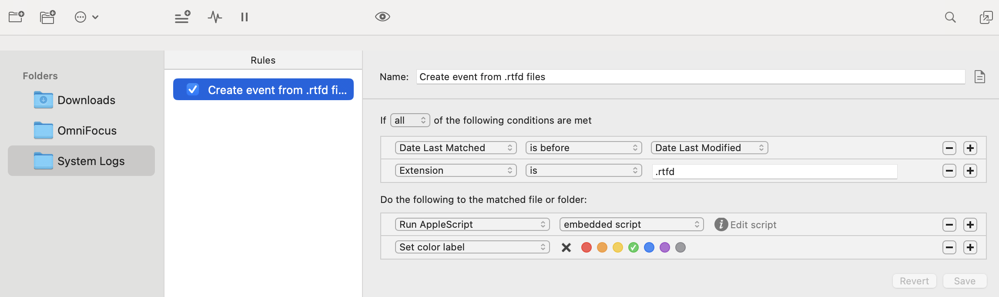

# Vitamin-R_to_Calendar
Automation for sync Vitamin-R (pomodoro app) with Calendar (Fantastical)

### Requirements:

- Hazel. This app tracks changes in files and can run embedded script to do something that you want
- Vitamin-R. Pomodoro technik app
- Fantastical. Calendar-app. It has CLI interface that we will use

### Hazel, 1 rule:

- **Create event from .rtfd files**


Hazel AppleScript:
``` applescript
-- Раскомментировать для дебага
-- set theFile to "Users:orokhovatskiy:Library:Containers:net.publicspace.mas.vitaminr4:Data:Library:Application Support:Vitamin-R 4:System Logs:System Log Day 2024-01-12 (bcd0745ec37c).rtfd"

-- Основной код
set theFile_POSIX to POSIX path of theFile

-- Скармливаем переменной theLogFile преобразованный .txt документ .rtfd через консоль
set theLogFile to do shell script "textutil -stdout -convert txt " & quoted form of theFile_POSIX as «class utf8»

-- Нарезаем наш лог файл на строки (time slice)
set timeSlices to paragraphs of theLogFile -- Split the log file into separate time slices

-- Объявляем переменные
set objective to ""
set tags to ""
set actualDuration to ""
set startDate to ""
set objectiveData to ""

-- TODO. Провести ревью кода
-- Парсим каждую строку (time slice)
repeat with i from 1 to count timeSlices
	set timeSlice to item i of timeSlices
	
	-- Extract the objective from the time slice
	if timeSlice contains "#objective" then
		set i to i + 1
		set timeSlice to item i of timeSlices
		set objective to timeSlice
	end if
	
	-- Extract tags from the time slice
	if timeSlice contains "#tags" then
		set i to i + 1
		set timeSlice to item i of timeSlices
		set tags to timeSlice
	end if
	
	-- Extract the duration from the time slice
	if timeSlice contains "#actualDuration" then
		set i to i + 1
		set timeSlice to item i of timeSlices as integer
		if timeSlice > 60 then
			set timeSlice to timeSlice div 60
		else
			set timeSlice to 1
		end if
		set actualDuration to timeSlice
	end if
	
	-- Extract the date from the time slice
	if timeSlice contains "#startDate" then
		set i to i + 1
		set timeSlice to item i of timeSlices
		set startDate to timeSlice
	end if
	set objectiveData to "\"" & objective & "\"" & " for " & actualDuration & " min " & "since " & startDate & " /" & tags
	-- end if
	set MaximumLinesInLog to i
end repeat

-- Создаем событие в Fantastical
set timeSlices to paragraphs of objectiveData

repeat with i from 1 to count timeSlices
	set object to item i of timeSlices
	tell application "Fantastical"
		-- display dialog object
		parse sentence object with add immediately
	end tell
end repeat
```

You can find hazelrules in ["src" folder](/src/Vitamin-R.hazelrules)